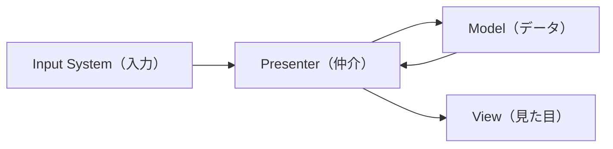

# アーキテクチャ: MVPパターン

## 1.MVPパターンの実装

### 各要素の責務

- Model: データの保持と計算（HP、弾数、SO_Data の読み込み）。GameObjectなどには極力依存させない。
  - ここでいうModelはC#のクラスであり、GameObjectではない。型のようなもの。
- View: 見た目と入力の受け口（UIの表示、アニメーション再生、InputSystem の生入力）。
- Presenter: 両者の仲介。Modelの数値が変わったらViewを更新し、Viewでの入力をModelの処理へ繋ぐ。

### データの流れ

### 実装ルール

- ViewからModelを直接触らない: `PlayerView` が `PlayerModel.HP` を直接書き換えることを禁止する。

- ModelはViewに依存しない: `Model` クラス内に `using UnityEngine.UI;` などのUI関連のコードを書かない。

- SO_Dataの扱い: `SO_Data/` 内の `ScriptableObject` は `Model` の初期値として `Presenter` が読み込み、動的な数値は `Model` クラス（C#）にコピーして管理する。

## コアシステム構成

拡張性と保守性を高めるために以下のコアシステムで構成します。

### 1. 共通基盤

- **GameManager**: ゲーム全体の進行（State）を管理。
- **SoundManager**: BGM/SEの再生管理。`Audio/` 以下のリソースを制御。

### 2. データ設計

- **ScriptableObject**: 敵のステータスや武器性能は `SO_Data/` で定義し、コードを変更せずに調整可能にする。
