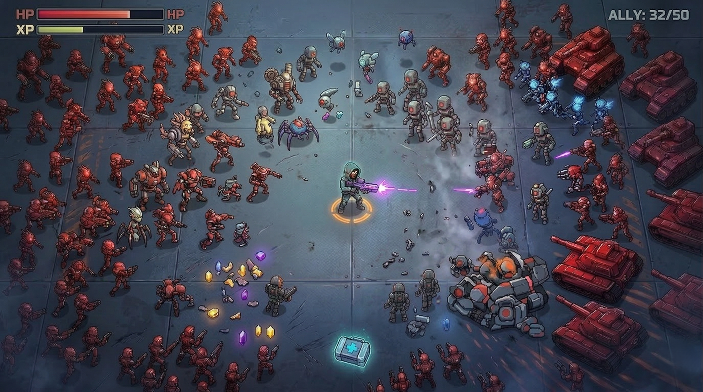
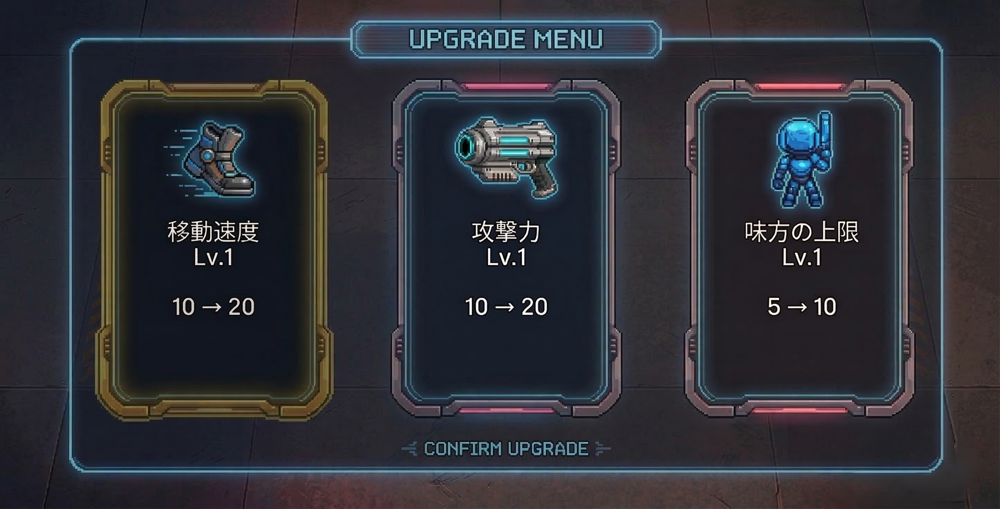

# ゲーム企画書：『Code: Reset』

  

## 1. コンセプト
自ら設計したサイバーロボットが暴走。 \
生みの親である主人公が、ロボットたちをハッキングして自軍に引き入れながらタワーの階層を突破し、最上階にある管理システムの停止を目指す、2Dアクションサバイバルゲーム。

## 2. ターゲット層
- 『ダダサバイバー』『Vampire Survivors』などのローグライトアクションが好きなプレイヤー
- 大軍団を率いて圧倒的な弾幕で敵を殲滅する爽快感や、SFの世界観が好きなプレイヤー

## 3. 基本仕様・操作系
- **ステージ構造:** スクロールなしの固定画面（長方形の密室）。1画面＝タワーの1階層。
- **操作方法:**
  - **左スティック:** 主人公の移動
  - **右スティック:** 射撃方向の指定
  - 自動射撃
  - **Aボタン:** 決定
  - **Bボタン:** キャンセル

## 4. コアメカニクス（独自の面白さ）

### 1.ハッキング（必殺技での軍団化）
敵を1体ずつハッキングするのではなく、必殺技を用いて一網打尽に寝返らせるシステム。 \
（スプラトゥーンのスペシャルのイメージ）
1. **ゲージ蓄積:** 敵を倒すとドロップする「経験値」を拾うことで、主人公の「ハッキングゲージ」が溜まる。
2. **任意発動:** ゲージMAX時、任意のタイミングでボタンを押すと、主人公を中心に広範囲の「ハッキング・ウェーブ（EMP爆発）」が発動。
3. **軍団化:** ウェーブに巻き込まれた敵は一瞬でスタンし、味方へと変化する。

### 2.味方ロボット（軍団）の挙動
- **追従（ピクミン方式）:** ハッキングされた味方ロボットは、自動的に主人公の周囲に付き従い、敵の攻撃を防ぐ盾として機能する。
- **一斉射撃:** 主人公が右スティックで射撃方向を変えると、従えている味方ロボット全員が主人公と同じ方向へ一斉に射撃を行う。 \
味方が増えるほど、圧倒的な弾幕を形成できる。

## 5. ゲームフロー

| フェーズ | 概要・プレイヤーの行動 |
| :--- | :--- |
| **1. 敵の侵攻** | 階層には四方から敵が湧く。敵を倒して経験値を集め、落ちているアイテムを活用する。 |
| **2. 階層突破** | 敵を全滅させる。次の階層へ進む。 |

## 6. スキル・ビルドの方向性
レベルアップ時の強化は、複雑な進化スキルなどは設けず、直感的な「パラメータの強化」のみとする。大きく2系統のプレイスタイルに分岐する。

  

- 【プレイヤー強化系（遊撃・アタッカー型）】:
  - 移動速度、主人公自身の弾の威力などを強化。
  - 機動力を活かして敵の攻撃を避け、自らのショットで敵を崩すプレイスタイル。
- 【軍団強化系（動く要塞・コマンダー型）】:
  - 同時に連れ歩ける「味方ロボットの上限数」を強化。
  - 圧倒的な物量と一斉射撃の弾幕で敵をすり潰すプレイスタイル。

## 7. アイテム・リソース
- **ドロップアイテム:** 「HP回復」アイテムのみが低確率で出現。
- **プレイへの影響:** 敵に突っ込んでアイテムを取りにいくか、そのまま戦うか考えさせることでジレンマを生む。

## 8. ゲームオーバー条件
- 主人公のHPが0になること
- セキュリティ端末が壊されること

## 9. 敵キャラクターの基本バリエーション
複数の役割の異なる敵を配置する。
1. **スウォーム型:** HPは低く大量に湧いて突っ込んでくる。ウェーブの餌兼、盾削り役。
2. **シューター型:** 距離を取り、遠距離から弾を撃ってくる。優先的にエイムを合わせて倒すべき対象。
3. **タンク型:** 高耐久で、味方の陣形を崩しながら突進してくる。ハッキングできれば強力な味方になる。